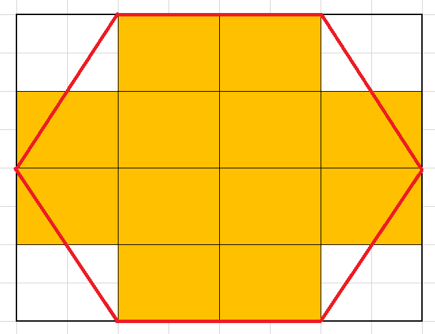
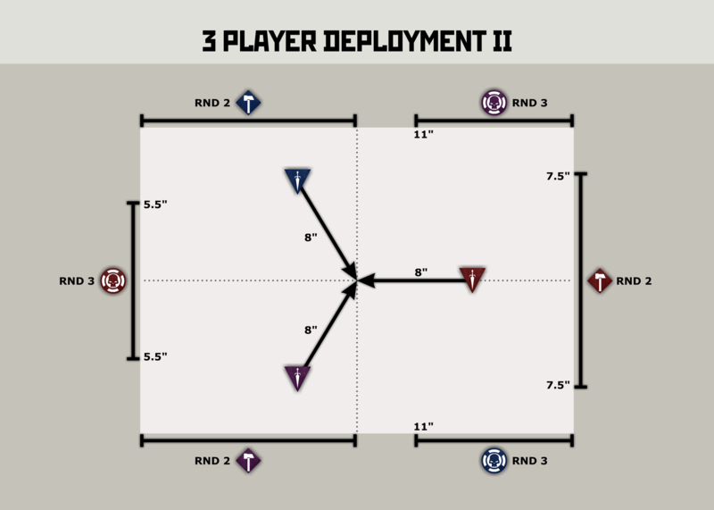

## 3 Spieler Deployment
### Sechseckiges Spielfeld

Die einfachste Möglichkeit das Deployment für drei Spieler fair zu gestalten ist, wenn man das Spielfeld anpasst. Bei einem sechseckigen Feld hat jeder dieselbe Ausgangsposition und auch das Verteilen des Loot (auf der andere Hälfte) ist leicht machbar.

Der offensichtliche Nachteil ist, dass unser schönes Gelände alles viereckig ist. Die vermutlich beste Möglichkeit mit Labers Platten ist folgende:

Ist ein bisschen fuzzy an den Schrägen, wo genau das Spielfeld endet und wir brauchen ein bisschen Gerümpel für die Fläche ohne Terrain, aber etwas Besseres ist mir nicht eingefallen.  
Ist auch nicht komplett mathematisch korrekt (da die Schrägen etwas länger sind als die geraden Teile).

### Quadratisches Spielfeld
Auch da haben sich Nerds schonmal Gedanken gemacht: [Link]( https://www.tga.community/forums/topic/23476-3-players-triumph-treachery-deployments/)

Das Ganze zielt auf ein anderes Spiel ab und ich habe die Bilder in aller Ehrlichkeit nicht komplett durchschaut. Relevant für uns ist (vermutlich) folgendes Bild:

Die Zonen die hier RND 3 heißen sind für uns vermutlich gute Deployment Zonen. Probleme sind, dass mir nicht ersichtlich ist, wie tief die Zonen sein sollen (was a für die Entfernungen sehr relevant ist) und ob die Zahlen bei uns passen. Das Feld hier hat 30" x 22".   
Und um das Explizit für unsere Platte zu berechnen fehlt mir derzeit die Muse.

Darüber hinaus wird es auch schwierig den Loot nachvollziehbar fair zu verteilen.

Habt ihr noch weitere Ideen zum Deployment und Loot Placement?
