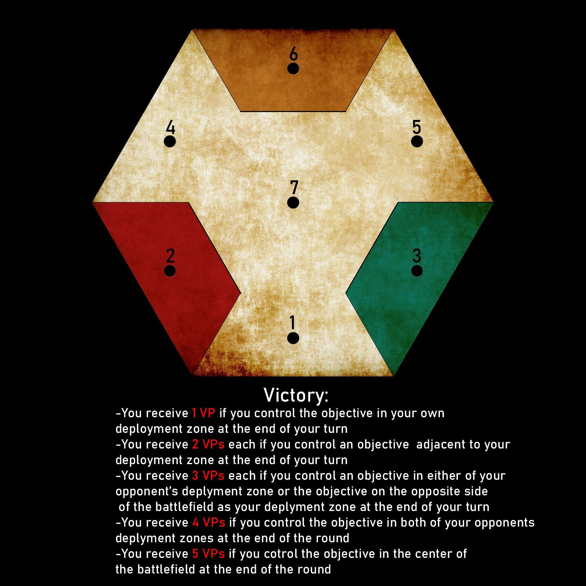

## House Rules: 

> Jedes Team hat eine maximale Größe von 7 (Captain, XO und 5 crew men)

> Man darf keine Grenadiere anheuern

> Jeder Spieler darf 2 Loot Tokens (1x Data, 1x Physical) pro Mission platzieren

> Missions Liste
 + The Botched Deal
 - Salvage Crew
 - Steam Vents of the Undercity
 - Data Vault (denke ich) 
 - Skymine
 - Broken Fence (3 Löcher im Zaun) 
 - Starport Raid (ggf mehr als 4 Raumschiffe) 
 - Overgrown Factory

> Der Spieler mit den wenigsten gesammelten XP im Laufe der Kampagne darf die nächste Mission wählen

> Sechseckiges Spielfeld - Aufstellung an 3 der 6 Seiten, jeweils innerhalb von 5" von der Mitte dieser Seite

## Fragen und Antworten:

Weniger Dudes für ein schnelleres Spiel.
- die Vermutung ist, dass es mit 3 Spielern sehr viel länger dauert. Um dem entgegenzuwirken sollten wir weniger Minis aufs Brett stellen. 
> House Rule: max Größe eines Teams 7 statt 10

Granatwerfer sind Broken!
- wir hatten schon die entschärfte Variante gespielt, bei der ein miss nichts macht. Auch das war zu gut. 
> Vorschlag: man darf den Grenadier nicht anheuern

Gute 3 Spieler Szenarios
- einige Maps eignen sich nicht für 3 Spieler (The Derelict Warship)

> Wir müssen einige Szenarien ausschließen

Szenarios die funktionieren:
 - The Botched Deal
 - Salvage Crew
 - Steam Vents of the Undercity
 - Data Vault (denke ich) 
 - Skymine
 - Broken Fence (3 Löcher im Zaun) 
 - Starport Raid (ggf mehr als 4 Raumschiffe) 
 - Overgrown Factory
 - Fire Moon (hier bin ich mir nicht sicher. Y Form der Flüsse? Oder 3 Flüsse) 

Loot Verteilung
 - Wieviel Loot Token und wo sollen sie platziert sein? 
> Vorschlag: Jeder Spieler platziert 2 Tokens (plus der Obligatorische Token in der Mitte des Feldes

Deployment fair gestalten
- wenn einer zwischen den anderen beiden sitzt ist es bedeutend schwieriger

> Vorschlag: Möglichst symmetrische Aufstellungen produzieren bei der alle etwa gleich weit voneinander weg sind 
